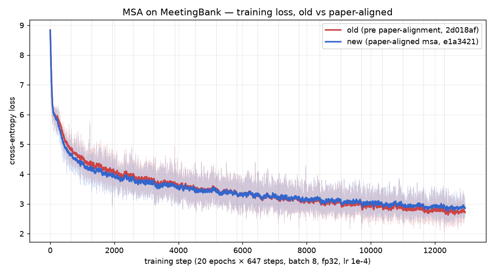
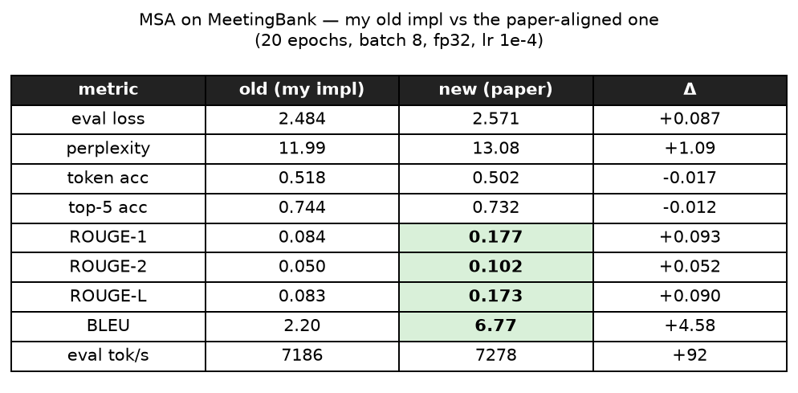

# Transformer

A modular PyTorch transformer for research. Every component — attention, FFN, normalization, positional encoding, residual connection, optimizer, dataset — is registered by name and selected from a YAML. Swap anything without touching the trainer.

Supports both encoder-decoder summarization (MeetingBank, Multi-News) and decoder-only causal-LM pretraining at the ~500M-parameter scale (FineWeb-Edu, FSDP, bf16, KV-cache generation).

## Why this exists

Started as a hand-rolled transformer for meeting summarization. Trying any new attention or connection variant meant editing several files. This rewrite makes the base composable — experiments are one YAML each, components are decoupled, the trainer doesn't know what attention you picked.

## Quick start

```bash
pip install -e .

# default: residual transformer on MeetingBank
python -m src.cli.train

# ~500M decoder-only pretrain on FineWeb-Edu
python -m src.cli.train +experiment=pretrain_500m

# mix and match anything inline
python -m src.cli.train attention=gqa_rope feedforward=swiglu normalization=rmsnorm
```

## Adding a new component

Same four steps for every kind (attention, FFN, norm, optimizer, dataset, ...):

1. Write the class. Inherit from the base, decorate with `@<KIND>.register("name")`.

   ```python
   # src/components/attention/my_attn.py
   @ATTENTION.register("my_attn")
   class MyAttention(AttentionBase):
       ...
   ```

2. Import the module in the package's `__init__.py` so the decorator runs at import time.
3. Add `configs/attention/my_attn.yaml` with `name: my_attn` and any kwargs.
4. Use it: `python -m src.cli.train attention=my_attn`.

No trainer or builder edits needed.

## What's available

| Group | Choices |
|-------|---------|
| Attention | mha, gqa, gqa_rope, mqa, sliding_window, sliding_gqa, gemma3_hybrid, csa, hca, mla, msa. See [`docs/attention.md`](docs/attention.md) for the variant notes and diagrams. |
| FFN | relu, swiglu, geglu. See [`docs/feedforward.md`](docs/feedforward.md). |
| Normalization | layernorm, rmsnorm. See [`docs/normalization.md`](docs/normalization.md). |
| Positional | sinusoidal, rope, alibi, rope/nope hybrid. See [`docs/positional.md`](docs/positional.md). |
| Connection | residual, residual_sandwich, hyperconnection, mhc. See [`docs/connections.md`](docs/connections.md). |
| Optimizer | adamw, muon_adamw, lion, adafactor, ademamix, mars_adamw. See [`docs/optimizers.md`](docs/optimizers.md). |
| Scheduler | cosine_warmup, linear_warmup, inverse_sqrt_warmup, polynomial_warmup, wsd, none. See [`docs/schedulers.md`](docs/schedulers.md). |
| Dataset | meetingbank, multi_news, fineweb_edu, c4, wikitext, wikipedia. See [`docs/datasets.md`](docs/datasets.md). |

Plus: bf16/fp16 autocast, gradient accumulation, `torch.compile`, DDP/FSDP, HF Hub push, KV-cache `.generate()` across every attention variant, Rich TUI.

## MSA paper-alignment: old vs new

The first cut of MSA (minimax sparse attention) was close to the paper but not exact. [`fix(attention): align msa with paper`](../../commit/e1a3421) corrected it. To check the fix was actually worth it I trained both versions on the same footing — MeetingBank causal summarization, 20 epochs, batch 8, fp32, lr 1e-4, identical seed/data — and evaluated the final checkpoints on the validation split (core metrics over 100 batches, ROUGE/BLEU over 16 generated summaries).





| metric | old (`2d018af`) | new (`e1a3421`) | Δ new−old |
|--------|----------------:|----------------:|----------:|
| eval loss | 2.484 | 2.571 | +0.087 |
| perplexity | 11.99 | 13.08 | +1.09 |
| token acc | 0.518 | 0.502 | −0.017 |
| top-5 acc | 0.744 | 0.732 | −0.012 |
| ROUGE-1 | 0.084 | **0.177** | +0.093 |
| ROUGE-2 | 0.050 | **0.102** | +0.052 |
| ROUGE-L | 0.083 | **0.173** | +0.090 |
| BLEU | 2.20 | **6.77** | +4.58 |
| eval tok/s | 7186 | 7278 | +92 |

The new implementation is the one from the official MiniMax tech report; the old one was my own approximation of it. Two things changed in `msa.py`, and both are about dropping my shortcuts in favour of what the report actually specifies:

1. **how the block selector gets trained.** my old version kept hard top-k for the forward pass but added the index branch's block log-probs straight onto the sparse attention logits (`block_score_bias`), purely so `w_iq`/`w_ik` would get gradient from the LM loss. it works, but it contaminates the attention the model actually uses — every value ends up weighted by a blend of real query-key affinity and a coarse block-level score. the report doesn't do that. the new version detaches the index branch entirely, keeps the forward logits pure `q·k`, and trains the selector with a separate KL loss (`kl_alignment_loss`) that matches the index distribution to the full attention's. the selector learns to *predict* which blocks real attention wants instead of leaking into it.

2. **the local block is now mandatory.** old top-k just took the k highest-scoring blocks, so the block containing the query itself could get dropped when the index scores were noisy. the new one reserves a slot for the local block and fills the rest with the best non-local blocks, exactly as in the report — and for a decoder the most recent tokens are the ones you can least afford to miss.

with that, the numbers make sense. under teacher forcing the old score-bias acts like a mild prior: the gold token is handed over at every step, nothing goes off the rails, and the extra bias even nudges perplexity slightly lower — which is why old looks a hair better on eval loss / ppl / token accuracy. but that regime never stresses the selector. the moment you generate free-running, the two fixes pay off: clean attention, a selector trained to mimic it, and guaranteed local context mean errors stop compounding. that's the ~2× ROUGE and ~3× BLEU jump (ROUGE-L 0.083 → 0.173, BLEU 2.2 → 6.8). throughput is identical, so it's a pure correctness win — the teacher-forced numbers that "favour" the old impl are an artifact of the crutch, not a real edge. judge attention on generation, not perplexity.

## Tests

```bash
pytest tests/ -q
```

## License

Apache-2.0. See [`LICENSE`](LICENSE).
