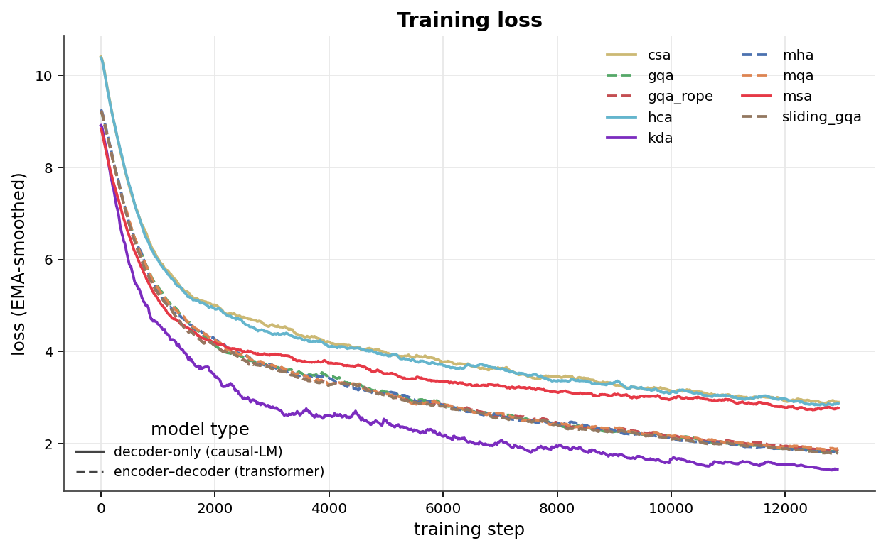
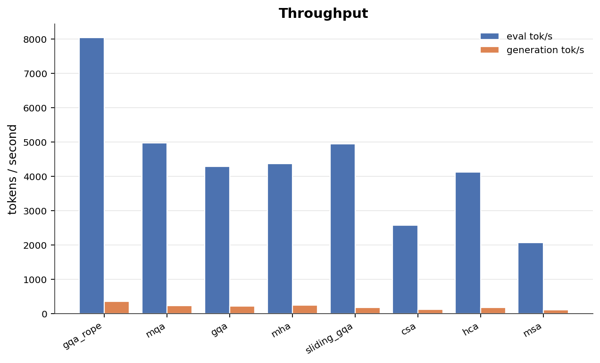
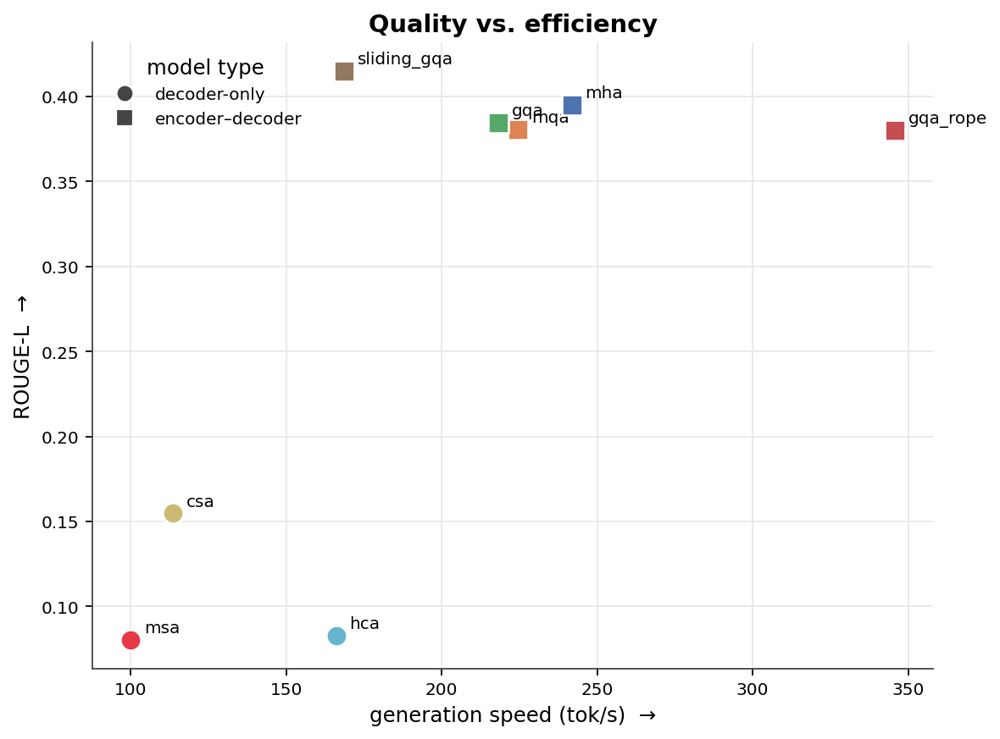
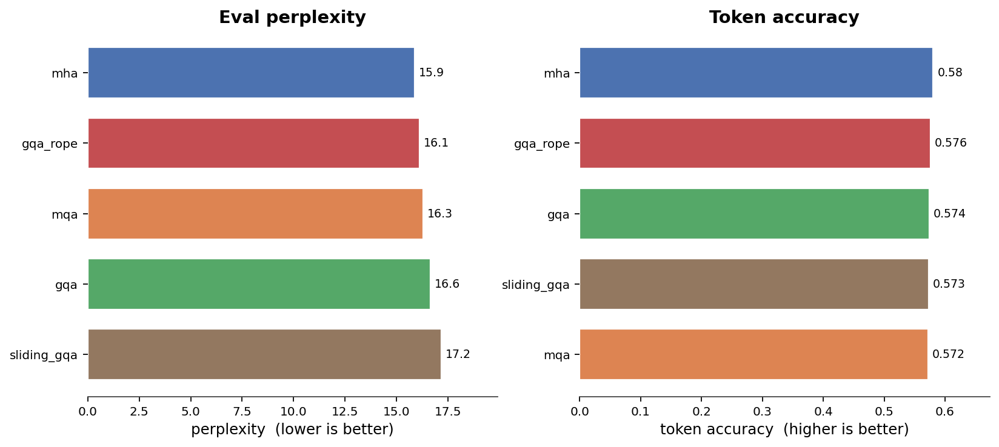
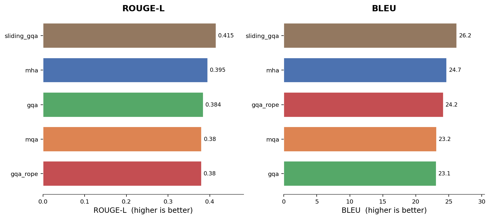
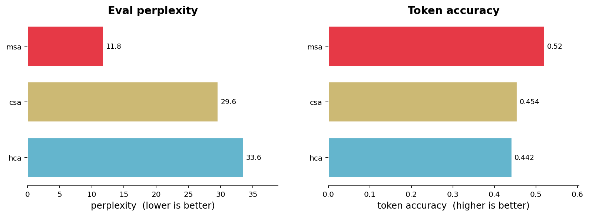
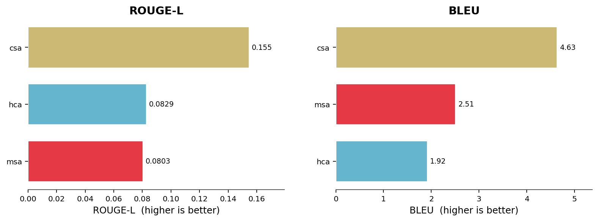

# Transformer Lab — Attention Benchmark

Attention variants trained on MeetingBank, grouped into the two model families they were trained in — **encoder–decoder transformers** and **decoder-only (causal-LM)** models. Because the families optimise different objectives, the quality metrics are benchmarked **separately per family**; only the cross-cutting views (training loss, throughput, and the speed/quality overview) place them on a shared axis.

**Setup** — dataset `meetingbank` / `validation` · generation samples `128` · precision `fp32` · [model collection](https://huggingface.co/collections/Pradheep1647/transformer-lab).

## Training loss

Training loss vs. step, pulled from each model's `loss_curve.csv` on the Hub and exponentially smoothed. **Solid** lines are decoder-only / causal-LM models (csa, hca, msa); **dashed** lines are encoder–decoder transformers (gqa, gqa_rope, mha, mqa, sliding_gqa). Shown together for reference, but the two families optimise different objectives so absolute loss is not directly comparable.

## Throughput

Evaluation and autoregressive-generation speed in tokens per second — the metric that is directly comparable across both families.

## Quality vs. efficiency

> Cross-family overview only. ROUGE-L against generation speed for all variants (circles = decoder-only, squares = encoder–decoder). Quality is *not* comparable across families — see each family's own section below for the head-to-head numbers.

## Encoder–decoder transformers

**Highlights**

- Lowest perplexity — **mha** (15.9).
- Best generation overlap (ROUGE-L) — **sliding_gqa** (0.415).
- Fastest generation — **gqa_rope** (346 tok/s).

### Evaluation quality

Teacher-forced perplexity (lower is better) and next-token accuracy on the held-out validation split.

### Generation quality

Summary-generation overlap against reference summaries (ROUGE-L and BLEU).

Raw metrics — Encoder–decoder transformers

| Attention Variant | Repo | Status | Loss | PPL | Tok Acc | ROUGE-L | BLEU | Tok/s | Gen tok/s |
|---|---|---:|---:|---:|---:|---:|---:|---:|---:|
| mha (multi-head attention) | [`Pradheep1647/run_mha-meetingbank-bs8-e20-fp32-19`](https://huggingface.co/Pradheep1647/run_mha-meetingbank-bs8-e20-fp32-19) | ok | 2.764 | 15.86 | 0.5804 | 0.3951 | 24.71 | 4364 | 241.9 |
| gqa_rope (grouped-query attention + RoPE) | [`Pradheep1647/run_gqa_rope-meetingbank-bs8-e20-fp32-19`](https://huggingface.co/Pradheep1647/run_gqa_rope-meetingbank-bs8-e20-fp32-19) | ok | 2.78 | 16.12 | 0.5762 | 0.3799 | 24.18 | 8039 | 345.8 |
| mqa (multi-query attention) | [`Pradheep1647/run_mqa-meetingbank-bs8-e20-fp32-19`](https://huggingface.co/Pradheep1647/run_mqa-meetingbank-bs8-e20-fp32-19) | ok | 2.791 | 16.29 | 0.5722 | 0.3804 | 23.15 | 4972 | 224.6 |
| gqa (grouped-query attention) | [`Pradheep1647/run_gqa-meetingbank-bs8-e20-fp32-19`](https://huggingface.co/Pradheep1647/run_gqa-meetingbank-bs8-e20-fp32-19) | ok | 2.811 | 16.63 | 0.5737 | 0.3843 | 23.11 | 4289 | 218.2 |
| sliding_gqa (sliding-window grouped-query attention) | [`Pradheep1647/run_sliding_gqa-meetingbank-bs8-e20-fp32-19`](https://huggingface.co/Pradheep1647/run_sliding_gqa-meetingbank-bs8-e20-fp32-19) | ok | 2.843 | 17.17 | 0.573 | 0.4149 | 26.24 | 4939 | 168.7 |

## Decoder-only (causal-LM)

> **Why this family scores much lower on generation.** Encoder–decoder models get cross-attention that aligns the decoder directly to the source transcript, making the copy-heavy summarization task far easier; decoder-only models must learn that purely in-context. All three here also compress or sparsify the KV cache, discarding source detail that copying needs, and they show the classic teacher-forcing gap — msa reaches the lowest perplexity of any model yet near-zero BLEU, because low next-token loss does not survive free-running generation. Compare these variants against each other, not against the encoder–decoder family above.

**Highlights**

- Lowest perplexity — **msa** (11.8).
- Best generation overlap (ROUGE-L) — **csa** (0.155).
- Fastest generation — **hca** (166 tok/s).

### Evaluation quality

Teacher-forced perplexity (lower is better) and next-token accuracy on the held-out validation split.

### Generation quality

Summary-generation overlap against reference summaries (ROUGE-L and BLEU).

Raw metrics — Decoder-only (causal-LM)

| Attention Variant | Repo | Status | Loss | PPL | Tok Acc | ROUGE-L | BLEU | Tok/s | Gen tok/s |
|---|---|---:|---:|---:|---:|---:|---:|---:|---:|
| msa (minimax sparse attention) | [`Pradheep1647/run_msa-meetingbank-bs8-e20-fp32-19`](https://huggingface.co/Pradheep1647/run_msa-meetingbank-bs8-e20-fp32-19) | ok | 2.466 | 11.78 | 0.5203 | 0.0803 | 2.506 | 2060 | 99.99 |
| csa (compressed sparse attention) | [`Pradheep1647/run_csa-meetingbank-bs8-e20-fp32-19`](https://huggingface.co/Pradheep1647/run_csa-meetingbank-bs8-e20-fp32-19) | ok | 3.388 | 29.61 | 0.4543 | 0.1547 | 4.631 | 2570 | 113.6 |
| hca (heavily compressed attention) | [`Pradheep1647/run_hca-meetingbank-bs8-e20-fp32-19`](https://huggingface.co/Pradheep1647/run_hca-meetingbank-bs8-e20-fp32-19) | ok | 3.514 | 33.57 | 0.4417 | 0.08286 | 1.919 | 4119 | 166.2 |

## Models

All checkpoints are published in the  [transformer-lab collection](https://huggingface.co/collections/Pradheep1647/transformer-lab).

**Encoder–decoder**

-  **mha** [`Pradheep1647/run_mha-meetingbank-bs8-e20-fp32-19`](https://huggingface.co/Pradheep1647/run_mha-meetingbank-bs8-e20-fp32-19) (ok)
-  **gqa_rope** [`Pradheep1647/run_gqa_rope-meetingbank-bs8-e20-fp32-19`](https://huggingface.co/Pradheep1647/run_gqa_rope-meetingbank-bs8-e20-fp32-19) (ok)
-  **mqa** [`Pradheep1647/run_mqa-meetingbank-bs8-e20-fp32-19`](https://huggingface.co/Pradheep1647/run_mqa-meetingbank-bs8-e20-fp32-19) (ok)
-  **gqa** [`Pradheep1647/run_gqa-meetingbank-bs8-e20-fp32-19`](https://huggingface.co/Pradheep1647/run_gqa-meetingbank-bs8-e20-fp32-19) (ok)
-  **sliding_gqa** [`Pradheep1647/run_sliding_gqa-meetingbank-bs8-e20-fp32-19`](https://huggingface.co/Pradheep1647/run_sliding_gqa-meetingbank-bs8-e20-fp32-19) (ok)

**Decoder-only**

-  **msa** [`Pradheep1647/run_msa-meetingbank-bs8-e20-fp32-19`](https://huggingface.co/Pradheep1647/run_msa-meetingbank-bs8-e20-fp32-19) (ok)
-  **csa** [`Pradheep1647/run_csa-meetingbank-bs8-e20-fp32-19`](https://huggingface.co/Pradheep1647/run_csa-meetingbank-bs8-e20-fp32-19) (ok)
-  **hca** [`Pradheep1647/run_hca-meetingbank-bs8-e20-fp32-19`](https://huggingface.co/Pradheep1647/run_hca-meetingbank-bs8-e20-fp32-19) (ok)

## Warnings

- replaced published tokenizer.json with local causal tokenizer fallback for Pradheep1647/run_csa-meetingbank-bs8-e20-fp32-19
- replaced published tokenizer.json with local causal tokenizer fallback for Pradheep1647/run_hca-meetingbank-bs8-e20-fp32-19

