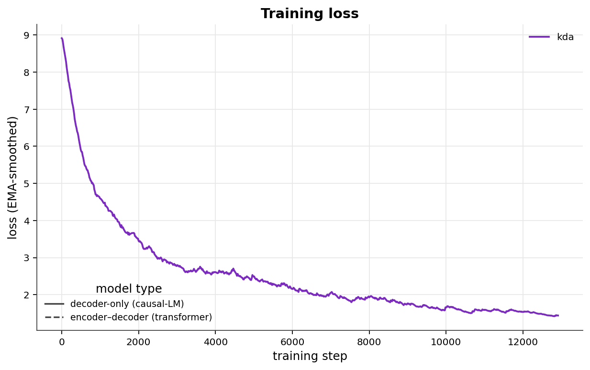
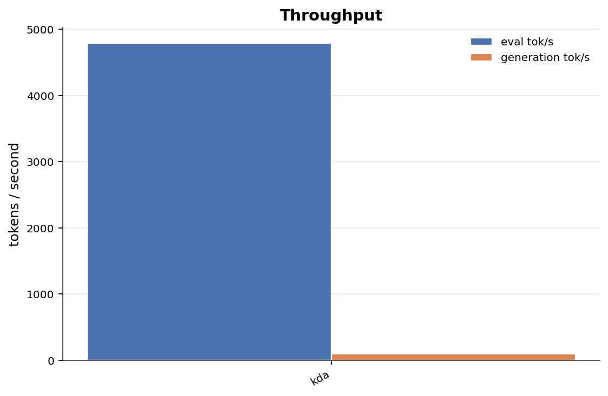
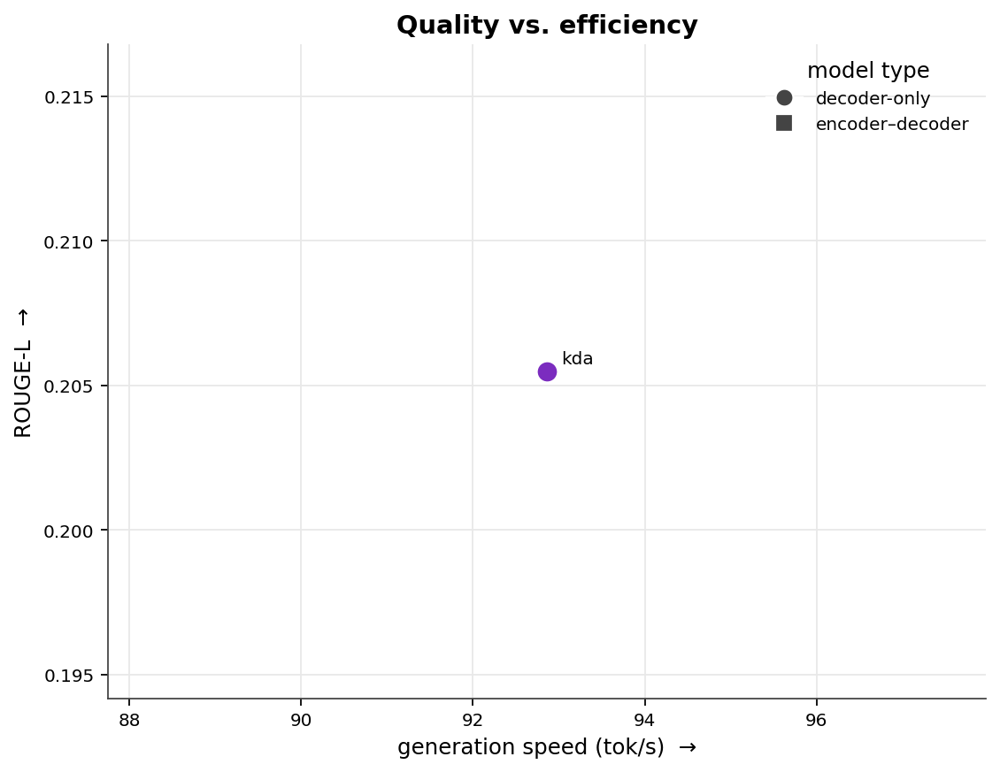
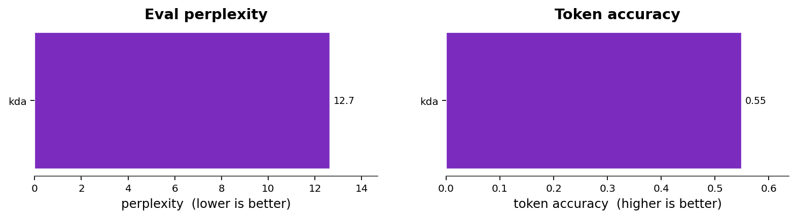
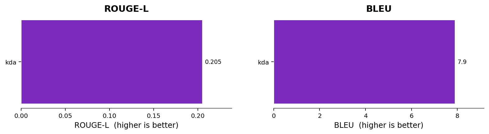

# Transformer Lab — Attention Benchmark

Attention variants trained on MeetingBank, grouped into the two model families they were trained in — **encoder–decoder transformers** and **decoder-only (causal-LM)** models. Because the families optimise different objectives, the quality metrics are benchmarked **separately per family**; only the cross-cutting views (training loss, throughput, and the speed/quality overview) place them on a shared axis.

**Setup** — dataset `meetingbank` / `validation` · generation samples `128` · precision `bf16` by checkpoint · [model collection](https://huggingface.co/collections/Pradheep1647/transformer-lab-6a07fe3185f5728e217997e0).

## Training loss

Training loss vs. step, pulled from each model's `loss_curve.csv` on the Hub and exponentially smoothed. **Solid** lines are decoder-only / causal-LM models (kda); **dashed** lines are encoder–decoder transformers. Shown together for reference, but the two families optimise different objectives so absolute loss is not directly comparable.

## Throughput

Evaluation and autoregressive-generation speed in tokens per second — the metric that is directly comparable across both families.

## Quality vs. efficiency

> Cross-family overview only. ROUGE-L against generation speed for all variants (circles = decoder-only, squares = encoder–decoder). Quality is *not* comparable across families — see each family's own section below for the head-to-head numbers.

## Encoder–decoder transformers

Raw metrics — Encoder–decoder transformers

| Attention Variant | Repo | Status | Loss | PPL | Tok Acc | ROUGE-L | BLEU | Tok/s | Gen tok/s |
|---|---|---:|---:|---:|---:|---:|---:|---:|---:|

## Decoder-only (causal-LM)

> **Why this family scores much lower on generation.** Encoder–decoder models get cross-attention that aligns the decoder directly to the source transcript, making the copy-heavy summarization task far easier; decoder-only models must learn that purely in-context. These models also compress or sparsify the KV cache, discarding source detail that copying needs, and they show the classic teacher-forcing gap — msa reaches the lowest perplexity of any model yet near-zero BLEU, because low next-token loss does not survive free-running generation. Compare these variants against each other, not against the encoder–decoder family above.

**Highlights**

- Lowest perplexity — **kda** (12.7).
- Best generation overlap (ROUGE-L) — **kda** (0.205).
- Fastest generation — **kda** (93 tok/s).

### Evaluation quality

Teacher-forced perplexity (lower is better) and next-token accuracy on the held-out validation split.

### Generation quality

Summary-generation overlap against reference summaries (ROUGE-L and BLEU).

Raw metrics — Decoder-only (causal-LM)

| Attention Variant | Repo | Status | Loss | PPL | Tok Acc | ROUGE-L | BLEU | Tok/s | Gen tok/s |
|---|---|---:|---:|---:|---:|---:|---:|---:|---:|
| kda (Kimi delta attention) | [`Pradheep1647/meeting_summarization_kda-meetingbank-bs8-e20-bf16-4`](https://huggingface.co/Pradheep1647/meeting_summarization_kda-meetingbank-bs8-e20-bf16-4) | ok | 2.538 | 12.66 | 0.5497 | 0.2055 | 7.903 | 4789 | 92.86 |

## Models

All checkpoints are published in the  [transformer-lab collection](https://huggingface.co/collections/Pradheep1647/transformer-lab-6a07fe3185f5728e217997e0).

**Decoder-only**

-  **kda** [`Pradheep1647/meeting_summarization_kda-meetingbank-bs8-e20-bf16-4`](https://huggingface.co/Pradheep1647/meeting_summarization_kda-meetingbank-bs8-e20-bf16-4) (ok)
