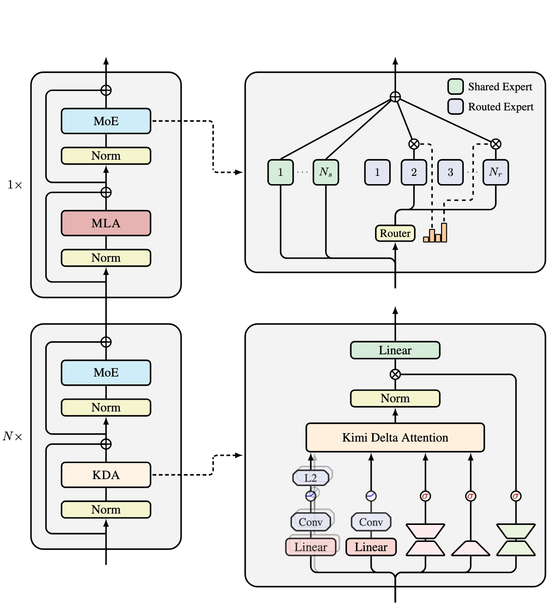
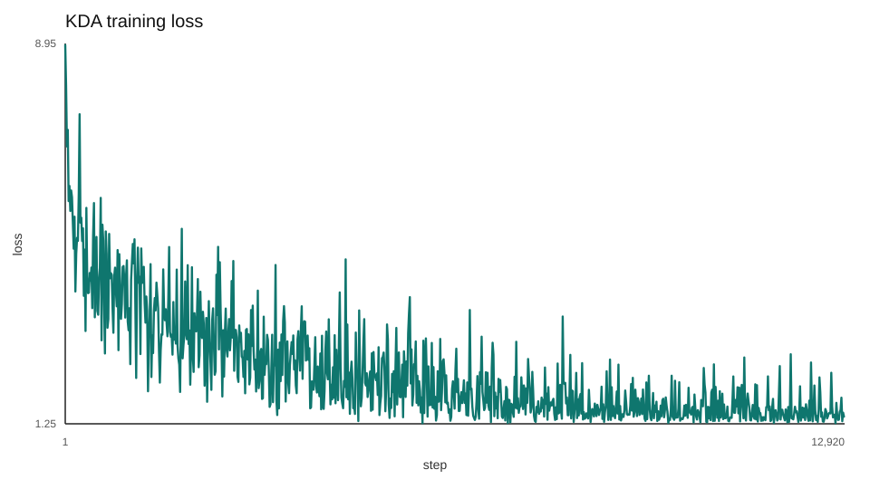

# Attention variants

This page keeps the attention family in one place. Each variant has its own architecture diagram, paper tag, local implementation/config links, and a short note on when to use it.

The diagrams use a black-canvas explainer style: token tensors, projection boxes, per-head lanes, attention heatmaps, and a bottom formula strip. They are exported as image assets from HTML-style layouts.

## `mha`


Multi-head attention is the baseline from [Attention Is All You Need](https://arxiv.org/abs/1706.03762). It projects the input into separate query, key, and value tensors, computes dense token-to-token attention, and applies the attention pattern to the values.

- Implementation: [`mha.py`](../src/components/attention/mha.py)
- Config: [`mha.yaml`](../configs/attention/mha.yaml)
- Use when: you want the clean reference path before testing cache or context-efficiency changes.

## `mqa`


Multi-query attention follows [Fast Transformer Decoding: One Write-Head is All You Need](https://arxiv.org/abs/1911.02150). Query heads stay separate, but all heads share one key stream and one value stream, reducing decode-time KV bandwidth.

- Implementation: [`mqa.py`](../src/components/attention/mqa.py)
- Config: [`mqa.yaml`](../configs/attention/mqa.yaml)
- Use when: KV-cache size and memory bandwidth matter more than per-head KV capacity.

## `gqa`


Grouped-query attention follows [GQA](https://arxiv.org/abs/2305.13245). It keeps multiple KV heads, but fewer than the number of query heads, so it sits between MHA and MQA.

- Implementation: [`gqa.py`](../src/components/attention/gqa.py)
- Config: [`gqa.yaml`](../configs/attention/gqa.yaml)
- Use when: you want most of MHA's modeling shape with a smaller KV cache.

## `gqa_rope`


`gqa_rope` combines [GQA](https://arxiv.org/abs/2305.13245) with rotary position embeddings from [RoFormer](https://arxiv.org/abs/2104.09864). In this repo, RoPE is applied inside attention to Q and K before grouped-KV attention runs.

- Implementation: [`gqa_rope.py`](../src/components/attention/gqa_rope.py)
- Config: [`gqa_rope.yaml`](../configs/attention/gqa_rope.yaml)
- Use when: you want grouped KV heads plus rotary positions.

## `sliding_window`


Sliding-window attention uses the local-window idea associated with [Longformer](https://arxiv.org/abs/2004.05150). It keeps dense heads, but the attention mask only allows nearby tokens through.

- Implementation: [`sliding_window.py`](../src/components/attention/sliding_window.py)
- Config: [`sliding_window.yaml`](../configs/attention/sliding_window.yaml)
- Use when: you want a local-context baseline without changing the head layout.

## `sliding_gqa`


`sliding_gqa` combines local-window attention with grouped KV heads. It has both the reduced attention span of sliding-window attention and the smaller KV layout of GQA.

- Implementation: [`sliding_gqa.py`](../src/components/attention/sliding_gqa.py)
- Config: [`sliding_gqa.yaml`](../configs/attention/sliding_gqa.yaml)
- Use when: you want local attention and grouped cache savings together.

## `gemma3_hybrid`


The Gemma-style hybrid pattern is tagged to the [Gemma 3 Technical Report](https://arxiv.org/abs/2503.19786). It composes existing repo variants: several local `sliding_gqa` layers followed by a global `gqa_rope` layer.

- Implementation: composed in [`builder.py`](../src/model/builder.py)
- Config: [`gemma3_hybrid.yaml`](../configs/attention/gemma3_hybrid.yaml)
- Use when: you want an interleaved local/global pattern without adding a new kernel.

## `mla`


Multi-head latent attention is tagged to [DeepSeek-V2](https://arxiv.org/abs/2405.04434). It caches a compact latent KV state plus a decoupled RoPE key, then reconstructs per-head K/V during attention.

- Implementation: [`mla.py`](../src/components/attention/mla.py)
- Config: [`mla.yaml`](../configs/attention/mla.yaml)
- Use when: KV-cache memory is the main target. The current implementation saves cache memory, but does not yet reduce decode-time projection FLOPs.

## `csa`


Compressed sparse attention is tagged to the [DeepSeek-V4 docs](https://huggingface.co/docs/transformers/main/model_doc/deepseek_v4). It compresses KV blocks, scores compressed entries with a sparse indexer, gathers top-k memory, keeps a local branch, and projects the result back through grouped output projection.

- Implementation: [`csa.py`](../src/components/attention/csa.py)
- Config: [`csa.yaml`](../configs/attention/csa.yaml)
- Use when: you want a long-context experiment that keeps local detail while sparsifying compressed long-range memory.

## `hca`


Heavily compressed attention is also tagged to the [DeepSeek-V4 docs](https://huggingface.co/docs/transformers/main/model_doc/deepseek_v4). It is the simpler compressed sibling of CSA: single-stream block compression, no sparse indexer, no local branch, then shared-KV attention over compressed entries.

- Implementation: [`hca.py`](../src/components/attention/hca.py)
- Config: [`hca.yaml`](../configs/attention/hca.yaml)
- Use when: you want a simpler compressed-memory attention path with heavier KV reduction.

## `msa`


MiniMax sparse attention follows [MiniMax Sparse Attention](https://arxiv.org/abs/2606.13392). It is a GQA-based block-sparse self-attention: a cheap index branch runs one index query per GQA group against a single shared index key head, block-max-pools token scores into per-block scores, always keeps the query's local block, and uses the remaining budget for top-k block selection. The main branch then runs exact GQA attention only over tokens gathered from those selected blocks, so each query attends to at most `top_k * block_size` keys instead of the whole sequence.

The implementation keeps the paper's separation between routing and attention: index scores choose blocks, but they are not added as a bias to the main attention logits. Because hard top-k routing is not differentiable, the module exposes `kl_alignment_loss(...)` to train the index branch against the group-averaged main-branch attention distribution on the selected token support, with detached teacher and hidden-state inputs.

- Implementation: [`msa.py`](../src/components/attention/msa.py)
- Config: [`msa.yaml`](../configs/attention/msa.yaml)
- Use when: you want long-context attention that keeps GQA's KV savings and adds learned block sparsity, picking which KV blocks each query reads instead of reading them all. For training, add the returned KL alignment term to the language-modeling loss.

## `kda`



*Official Kimi Linear architecture figure from [MoonshotAI/Kimi-Linear](https://github.com/MoonshotAI/Kimi-Linear/blob/master/figures/arch.png), © 2025 Moonshot AI, [MIT licensed](assets/kimi-linear-architecture.LICENSE). The lower-right panel is the KDA layer implemented here. The left side is Moonshot's hybrid stack; this repo's current experiment uses KDA in every attention layer instead of mixing KDA and MLA.*

Kimi Delta Attention comes from [Kimi Linear](https://arxiv.org/abs/2510.26692), with the two changes used by [Kimi K3](https://github.com/MoonshotAI/Kimi-K3/blob/main/k3_tech_report.pdf): lower-bounded channel decay and a full-rank output gate.

The input first splits into q, k, and v projections. Each branch runs through a causal depthwise convolution and SiLU; q and k are then L2-normalized. A separate low-rank branch produces one decay value for every key channel, while beta decides how strongly the current key-value pair should rewrite memory. The state update is the useful bit: decay the old matrix, read what it currently predicts for k, then write only the prediction error. Each head therefore carries one fixed `head_dim × head_dim` state instead of a token-by-token KV cache.

K3 bounds the log-decay with `g = -5 sigmoid(exp(A) z)` and uses `alpha = exp(g)`. This keeps every step's log-decay inside `(-5, 0)`. After reading the updated state with q, the implementation applies head-wise RMSNorm, a full-rank sigmoid gate from the original input, and the output projection.

For one head, the recurrence is:

\[
\bar{S}_t = \operatorname{Diag}(\alpha_t) S_{t-1}
\]

\[
e_t = v_t - k_t^\top \bar{S}_t, \qquad
S_t = \bar{S}_t + \beta_t k_t e_t^\top, \qquad
o_t = q_t^\top S_t
\]

The error term matters. KDA does not blindly add every value to memory. It asks what the current state already predicts for the key and writes only what is missing.

### execution paths

| Path | Used for | What it does |
| --- | --- | --- |
| exact recurrence | CPU and correctness tests | walks tokens one at a time in PyTorch and keeps the state in fp32 |
| chunkwise KDA | CUDA training | uses [`fla.ops.kda.chunk_kda`](https://github.com/fla-org/flash-linear-attention/blob/v0.5.0/fla/ops/kda/chunk.py) to process 64-token chunks with Triton while carrying the same fp32 state between chunks |

The CUDA path keeps q, k, and v in bf16 so the tensor-core kernels are actually used. Decay values and the recurrent state stay in fp32. This is still the same recurrence, not an approximation with a different cache layout, so checkpoints move between the exact and chunkwise paths without conversion.

`flash-linear-attention==0.5.0` is pinned because that version gives this repo the training-ready KDA kernel without replacing its Transformers and Tokenizers dependency stack.

### measured training cost

The original Python recurrence launched 768 serial updates per layer and managed only about 320 tokens/s on the local RTX 4060. One optimizer update took roughly 19.2 seconds, which put the full run near 69 hours.

With the chunkwise kernel, 50 real optimizer updates took 18.9 seconds including model and dataset startup, or about 0.38 seconds per update end to end. The completed 20-epoch run was faster once warm: all 12,920 optimizer updates finished in about one hour wall-clock, with 59m 46s between the first and last logged loss. That works out to roughly 0.28 seconds per optimizer update and about a 69× improvement over the Python recurrence.

The config uses batch size 1 with eight accumulated microbatches, so the effective batch is still eight. Progress and scheduler length are counted in optimizer updates: `floor(5169 / 8) × 20 = 12,920`, not 103,380 microbatches.

### completed MeetingBank run



This is the exact unsmoothed TensorBoard series from the fresh run, not the aborted slow runs that share the same log directory. All 12,920 raw points are also available as [`kda_training_loss.csv`](assets/kda_training_loss.csv). The last training loss was 1.3462 and the minimum logged training loss was 1.2534.

Training loss alone does not pick the checkpoint. The run saved epochs 0, 4, 8, 12, 16, and 19, so each of those six was evaluated over the full 861-batch MeetingBank validation loader:

| saved epoch | step | validation loss | perplexity | token accuracy |
|---:|---:|---:|---:|---:|
| 0 | 646 | 3.3420 | 28.2760 | 0.4379 |
| **4** | **3,230** | **2.5381** | **12.6559** | **0.5497** |
| 8 | 5,814 | 2.5980 | 13.4371 | 0.5646 |
| 12 | 8,398 | 2.7164 | 15.1258 | 0.5697 |
| 16 | 10,982 | 2.8413 | 17.1374 | 0.5725 |
| 19 | 12,920 | 2.9069 | 18.2993 | 0.5737 |

Epoch 4 wins on validation loss. The later checkpoints get slightly better at choosing the top token while becoming less calibrated overall, which is why token accuracy rises even as validation loss and perplexity get worse.

The trainer now handles this during the run. It validates halfway through each epoch and at the end, logs `val/loss`, and overwrites one `*_best.pt` file only when `current_val_loss < best_val_loss`. Set `training.preload=best` to resume that checkpoint. The six-file table above describes this completed run before best-only saving was added.

The selected epoch-4 checkpoint was then benchmarked through the same Hugging Face evaluation path as the other attention models. Core metrics use the full validation split; ROUGE and BLEU use the first 128 validation meetings with greedy generation.

| metric | value |
|---|---:|
| validation loss | 2.5381 |
| perplexity | 12.6559 |
| token accuracy | 0.5497 |
| top-5 accuracy | 0.7400 |
| ROUGE-1 | 0.2556 |
| ROUGE-2 | 0.0853 |
| ROUGE-L | 0.2055 |
| BLEU | 7.90 |
| evaluation throughput | 4,789 tok/s |
| generation throughput | 92.86 tok/s |
| average forward latency | 13.17 ms |
| peak CUDA memory | 189.5 MB |

The model has 30,896,560 parameters and the checkpoint is 370.9 MB. The raw selection record is [`checkpoint_selection.json`](../benchmarks/kda/checkpoint_selection.json), the complete benchmark record is [`results.jsonl`](../benchmarks/kda/results.jsonl), and the published model is [`Pradheep1647/meeting_summarization_kda-meetingbank-bs8-e20-bf16-4`](https://huggingface.co/Pradheep1647/meeting_summarization_kda-meetingbank-bs8-e20-bf16-4).

Run it without the dashboard or any startup prompt:

```bash
uv run python -m src.cli.train +experiment=meeting_summarization_kda training.tui=false
```

- Implementation: [`kda.py`](../src/components/attention/kda.py)
- Config: [`kda.yaml`](../configs/attention/kda.yaml)
- Training config: [`meeting_summarization_kda.yaml`](../configs/experiment/meeting_summarization_kda.yaml)
- Use when: you want to experiment with K3-style finite-state attention and constant-size decode memory. Run it as a causal LM with `positional=rope`; RoPE stays identity here, so KDA owns position and recency as intended.

## Model compatibility

The encoder-decoder path needs attention modules that support cross-attention and bidirectional encoder attention. In this repo, `mha`, `mqa`, `gqa`, `gqa_rope`, `sliding_window`, `sliding_gqa`, and `gemma3_hybrid` satisfy that path.

`csa`, `hca`, `mla`, `msa`, and `kda` are self-attention-only variants and should run through the causal-LM path. The builder enforces this split so an experiment does not silently train with the wrong topology.
