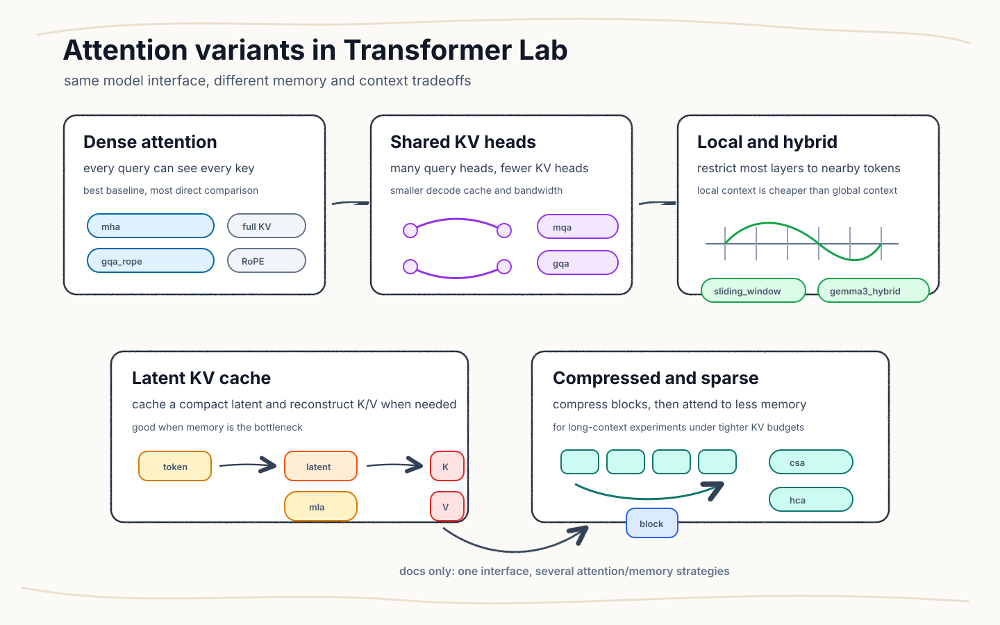

# Attention variants

This page keeps the attention family in one place: what each variant changes, which paper it points to, and when it is useful in this repo.

## Variants

| Variant | Implementation | Config | Paper tag | What changes |
|---|---|---|---|---|
| `mha` | [`mha.py`](../../src/components/attention/mha.py) | [`mha.yaml`](../../configs/attention/mha.yaml) | [Attention Is All You Need](https://arxiv.org/abs/1706.03762) | Standard dense multi-head attention. Every head owns its own query, key, and value projection. |
| `mqa` | [`mqa.py`](../../src/components/attention/mqa.py) | [`mqa.yaml`](../../configs/attention/mqa.yaml) | [Fast Transformer Decoding: One Write-Head is All You Need](https://arxiv.org/abs/1911.02150) | Shares one key/value head across all query heads to reduce decode-time KV bandwidth. |
| `gqa` | [`gqa.py`](../../src/components/attention/gqa.py) | [`gqa.yaml`](../../configs/attention/gqa.yaml) | [GQA](https://arxiv.org/abs/2305.13245) | Uses fewer KV heads than query heads, sitting between MHA quality and MQA cache cost. |
| `gqa_rope` | [`gqa_rope.py`](../../src/components/attention/gqa_rope.py) | [`gqa_rope.yaml`](../../configs/attention/gqa_rope.yaml) | [GQA](https://arxiv.org/abs/2305.13245), [RoFormer](https://arxiv.org/abs/2104.09864) | GQA with rotary position embeddings applied inside attention. |
| `sliding_window` | [`sliding_window.py`](../../src/components/attention/sliding_window.py) | [`sliding_window.yaml`](../../configs/attention/sliding_window.yaml) | [Longformer](https://arxiv.org/abs/2004.05150) | Dense heads, but attention is limited to a local window. |
| `sliding_gqa` | [`sliding_gqa.py`](../../src/components/attention/sliding_gqa.py) | [`sliding_gqa.yaml`](../../configs/attention/sliding_gqa.yaml) | [Longformer](https://arxiv.org/abs/2004.05150), [GQA](https://arxiv.org/abs/2305.13245) | Combines a local window with grouped KV heads. |
| `gemma3_hybrid` | composed in [`builder.py`](../../src/model/builder.py) | [`gemma3_hybrid.yaml`](../../configs/attention/gemma3_hybrid.yaml) | [Gemma 3 Technical Report](https://arxiv.org/abs/2503.19786) | Interleaves local `sliding_gqa` layers with global `gqa_rope` layers. |
| `mla` | [`mla.py`](../../src/components/attention/mla.py) | [`mla.yaml`](../../configs/attention/mla.yaml) | [DeepSeek-V2](https://arxiv.org/abs/2405.04434) | Caches a low-rank latent KV state and reconstructs per-head K/V during attention. |
| `csa` | [`csa.py`](../../src/components/attention/csa.py) | [`csa.yaml`](../../configs/attention/csa.yaml) | [DeepSeek-V4 docs](https://huggingface.co/docs/transformers/main/model_doc/deepseek_v4) | Compresses KV blocks, uses a sparse indexer, keeps a local branch, and applies shared-KV attention over selected memory. |
| `hca` | [`hca.py`](../../src/components/attention/hca.py) | [`hca.yaml`](../../configs/attention/hca.yaml) | [DeepSeek-V4 docs](https://huggingface.co/docs/transformers/main/model_doc/deepseek_v4) | A simpler compressed path: non-overlapping block compression, then shared-KV attention over compressed entries. |

## How to choose

Use `mha` when you want the clean baseline. Use `mqa` or `gqa` when decode cache size and bandwidth matter. Use `gqa_rope` when you want grouped KV heads plus rotary positions. Use `sliding_window` or `sliding_gqa` for local-context experiments where full attention is too expensive.

Use `gemma3_hybrid` when you want an interleaved local/global pattern. Use `mla` when KV-cache memory is the main target. Use `csa` or `hca` for compressed long-context experiments where the attention module itself owns the causal/self-attention behavior.

## Model compatibility

The encoder-decoder path needs attention modules that support cross-attention and bidirectional encoder attention. In this repo, `mha`, `mqa`, `gqa`, `gqa_rope`, `sliding_window`, `sliding_gqa`, and `gemma3_hybrid` satisfy that path.

`csa`, `hca`, and `mla` are self-attention-only variants and should run through the causal-LM path. The builder enforces this split so an experiment does not silently train with the wrong topology.
